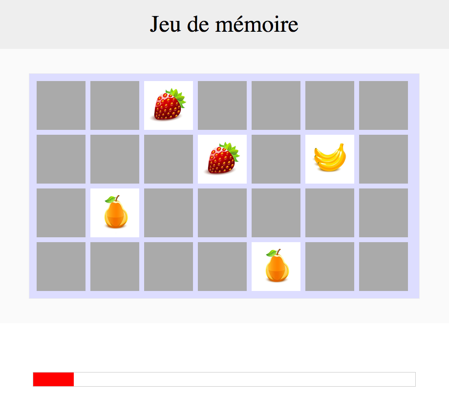

# Memory

The object of the game is to collect the most matching pairs in the time available.

I made this game to practice my javascript lessons last year. Feel free to use it, read the code, optimise, play, all you want whit this repo ! If you have any advice contact me !

# Setting Up the Game

Choose your difficulty mode :

- Easy : 50 seconds - 8 pairs
- Normal : 60 seconds - 14 pairs
- Hard : 90 seconds - 18 pairs

Play !

# Rules : 

- If your try of pair is wrong you can't select another card during 1 second
- If your try of pair is good you can select directly another card
- You win only if you find all pairs in the time available

# Screen during the game

# Author

snutij

[Licence](LICENSE)